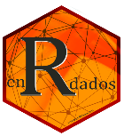

### Hola Mundo
Soy fervilber.

Estás en mi directorio público de github donde comparto ideas, proyectos y mucho entusiasmo.
Aquí puedes ver parte de mi y si te animas, también colaborar en estos proyectos.
- [mis proyectos personales](https://fervilber.github.io/glup/)
- :runner: Soy un ser humano, del tipo: *Ingeniero de Caminos, Canales y Puertos*. (somos escasos y raros  :octocat:)
- 🔭 Trabajo en el mundo del agua  :sweat_drops:, desalación y distribución , pero mi pasión es crear cosas, y para esto uso **R el lenguaje de la ciencia**
- 👯 En GitHub casi todo lo que comparto es de este maravilloso lenguaje :computer:
- :earth_africa: Me gustan los mapas y R está genial para hacerlos  
- Escribo principalmente en :es: , mi lengua materna, pero hablo también la de los piratas :gb: del mar.
 
- 📫 Contacto: <mailto:contactovilber@pm.me>

## Libros 📚 

He escrito o participado en algunos libros:
 - [Manual de R para el científico de datos](https://drive.google.com/open?id=1EoLm-rqr5eikmpodb90uIGyju6E1jBjZ)
 - [Memorias de un soldado](https://www.bubok.es/libros/266691/Memorias-de-un-soldado-1919-24)
 - [Aprendizaje supervisado en R](https://fervilber.github.io/Aprendizaje-supervisado-en-R/)

## Blog :rocket:

Soy autor del blog [enrdados.net](https://enrdados.netlify.app/) de educación y difusión de R como lenguaje de programación científico.

Anímate, échale un vistazo:

▶️ https://enrdados.netlify.app/

